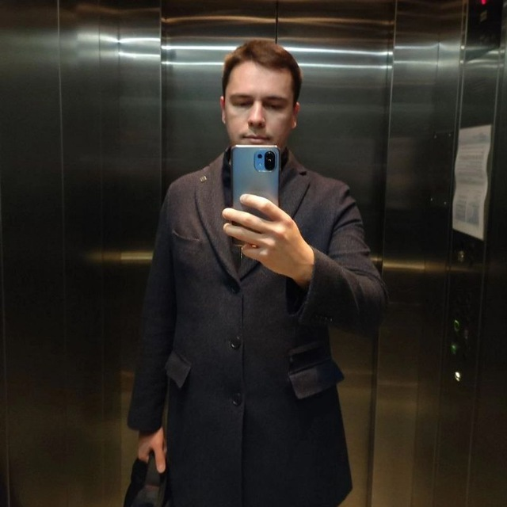

### About me

**Bulovatsky Denis**

[i@bulavackii.ru](i@bulavackii.ru)
_8(999)999-99-99_

Task: A novice web developer with minimal work experience, looking for a full-time web developer position in a growing, rapidly developing software startup.

Professional experience:

- GKB ... 
- Moscow, Russian Federation
- programmer
- July 2022- present

_Maintenance of medical systems and programs, improvement of functionality, deployment and debugging of tests, introduction of new software modules...

Designed, implemented and configured several significant software modules

Conducted training and support for various medical organizations ...

Analyzed many existing web pages, programs and applications to find and fix bugs and implement improvements to improve speed and functionality

He worked under the guidance of a programmer, an application developer who speaks Java, CSS and HTML, PHP, PAGE, SCSS
...._
